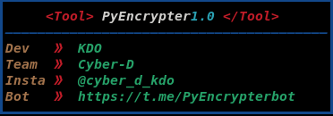

# PyEncrypter

PyEncrypter is a command-line tool developed by KDO from Cyber-D that allows you to encrypt Python3 code and make it executable on both Linux and Termux platforms. This tool ensures your Python code remains secure while still being executable on target systems.

## Features

- Encrypt Python3 code for added security.
- Make encrypted code executable on Linux and Termux.
- Simple and easy-to-use command-line interface.

### How to Install

Termux commands.

* `pkg update`

* `pkg upgrade`

* `pkg install git python3`

* `git clone https://github.com/kdo2064/PyEncrypter`

* `cd PyEncrypter`

* `python3 main.py`

Linux commands.

* `sudo apt update`

* `sudo apt upgrade`

* `sudo apt install python3 git`

* `git clone https://github.com/kdo2064/PyEncrypter`

* `cd PyEncrypter`

* `python3 main.py`

## Usage

To use Web-Hooker, follow these steps:

1. Once you run the main.py script, the tool will prompt you to provide the path to the Python3 code file you want to encrypt.
2. After specifying the file path, PyEncrypter will encrypt the code and generate an executable binary file.

You can repeat the process for multiple websites or exit the script.

## Disclaimer

PyEncrypter is a tool developed by KDO from Cyber-D. It is designed to encrypt Python3 code and make it executable on Linux and Termux platforms. While the tool aims to provide an additional layer of security for your Python code, it is essential to understand its limitations and potential risks.

**Please note the following:**

1. PyEncrypter is provided "as is," without warranty of any kind, express or implied. The developers will not be held responsible for any damage or loss caused by the use of this tool.

2. It is crucial to use PyEncrypter responsibly and only on code for which you have the necessary rights and permissions. Unauthorized use of this tool to encrypt and distribute code without proper authorization may violate copyright and other laws.

3. Encrypted code generated by PyEncrypter may not be entirely secure from all forms of reverse engineering or decryption. While the tool employs encryption techniques, it cannot guarantee absolute protection.

4. Using PyEncrypter on sensitive or confidential code does not make it immune to potential vulnerabilities or attacks. Always follow best security practices and keep your code and systems updated and protected.

5. PyEncrypter is intended for legal and ethical purposes. Any misuse of this tool for malicious or unauthorized activities is strictly prohibited.

By using PyEncrypter, you acknowledge and accept these disclaimers. The developers and maintainers of this tool are not liable for any issues arising from its usage. Always use this tool responsibly and in compliance with applicable laws and regulations.

If you have any concerns or questions about PyEncrypter's usage or its security features, please contact KDO via email at kdo@cyberd.com or visit our website [www.cyber-d.com](https://t.me/cyber_d_kdo).

**Use PyEncrypter responsibly and keep your code secure. Happy coding! 🚀**

## Disclaimer

